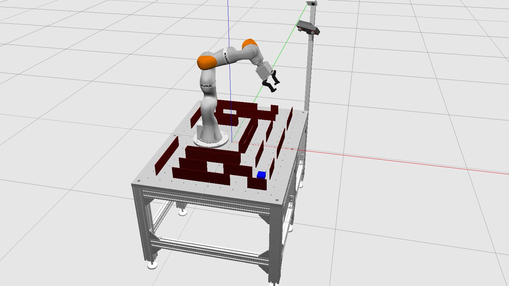

# kuka_arm
Kuka arm code for the kuka challenge.



## Installation
Kuka path planning project as Robotics Nanodegree Program Challenge with Kuka and KIT.

## Run the code
Follow this steps for a successful run:
Update/upgrade the system
```
apt-get update -y
apt-get upgrade -y
```
Download the code and Install all the packages dependencies
```
git clone https://github.com/milekium/kuka_arm.git
cd kuka_arm/
rosdep install --from-paths src --ignore-src -r -y
```
Build and source your catkin_ws
```
cd /kuka_arm/
catkin_make
source devel/setup.bash
```

## Usage: 
Launch all the project nodes
- We’ve combined all the launch files in a `start_project.sh` script. 
- Note: This script will only run if you are in the visual desktop, don't try to run it inside the workspace terminal!
```
cd kuka_arm/src/rll_planning_project/scripts/
./start_project.sh
```

## Credits: 
author: milekium.
[kuka](https://www.kuka.com/en-de).

## License: 
### GNU LGPL v3
[](https://www.gnu.org/licenses/lgpl-3.0)  

